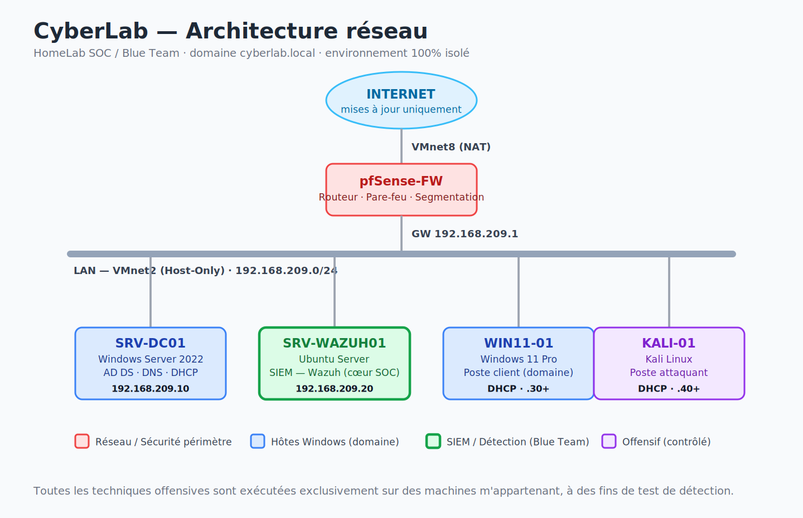

# 🛡️ CyberLab — HomeLab SOC / Blue Team

> Laboratoire de cybersécurité virtualisé reproduisant l'infrastructure d'une PME,
> conçu pour la **détection d'intrusion** : chaque attaque est jouée, **détectée** par
> le SIEM, puis **corrigée**. Approche *Attaque → Détection → Remédiation*.


---

## 🎯 Objectif du projet

Construire, de A à Z, l'infrastructure d'une petite entreprise fictive (**CyberLab**,
domaine `cyberlab.local`), puis l'utiliser comme terrain d'entraînement défensif :

- Monter une infrastructure Windows réaliste (Active Directory, DNS, DHCP, GPO).
- Déployer une chaîne de collecte de logs et un SIEM (**Sysmon + Wazuh**).
- Simuler des attaques Active Directory dans un environnement **contrôlé et isolé**.
- **Détecter** ces attaques via des règles de corrélation, et **durcir** l'infrastructure.
- Documenter chaque étape avec le mapping **MITRE ATT&CK** correspondant.

Ce projet est un **portfolio** : il vise à démontrer des compétences opérationnelles
de SOC analyst / Blue Team en vue d'une alternance en cybersécurité.

---

## 🧩 Le fil rouge : Attaque → Détection → Remédiation

C'est ce qui distingue ce lab d'un simple montage AD. Pour **chaque** scénario offensif,
la documentation suit la même structure :

| Étape | Question à laquelle on répond |
|-------|-------------------------------|
| 🔴 **Attaque** | Quelle technique ? (mappée MITRE ATT&CK) Comment est-elle exécutée ? |
| 🟠 **Trace** | Quel(s) log(s) génère-t-elle ? (Event ID Windows, événement Sysmon) |
| 🔵 **Détection** | Quelle règle Wazuh lève l'alerte ? Avec quel niveau de sévérité ? |
| 🟢 **Remédiation** | Quelle GPO / durcissement bloque ou réduit l'attaque ? |

---

## 🏗️ Architecture



> 📌 Détails, plan d'adressage et justification des choix dans
> [`docs/00-architecture.md`](docs/00-architecture.md).

| Machine | Rôle | OS | Réseau |
|---------|------|----|--------|
| `pfSense-FW` | Routeur / pare-feu / segmentation | pfSense | WAN (NAT) + LAN |
| `SRV-DC01` | Contrôleur de domaine, DNS, DHCP | Windows Server 2022 | LAN Serveurs |
| `SRV-WAZUH01` | SIEM / collecte de logs | Ubuntu Server | LAN Serveurs |
| `WIN11-01` | Poste client du domaine | Windows 11 Pro | LAN Clients |
| `KALI-01` | Poste d'attaque (offensif) | Kali Linux | LAN Clients |

---

## 🛠️ Stack technique

**Infrastructure** : VMware Workstation Pro · pfSense · Windows Server 2022 · Ubuntu Server
**Active Directory** : AD DS · DNS · DHCP · GPO · gestion OU/groupes · durcissement
**Détection (Blue Team)** : Sysmon · Windows Event Logs · Wazuh (SIEM/XDR) · MITRE ATT&CK
**Offensif (contrôlé)** : Kali Linux · Nmap · BloodHound · attaques AD
**Documentation** : Markdown · schémas réseau · captures annotées

---

## 📂 Structure du dépôt

```
cyberlab-soc-homelab/
├── README.md                         # Cette page
├── docs/
│   ├── 00-architecture.md            # Architecture, schéma réseau, plan d'adressage
│   ├── 01-infrastructure.md          # Hyperviseur, réseaux, pfSense
│   ├── 02-active-directory.md        # AD DS, DNS, DHCP, OU, users, groupes
│   ├── 03-hardening-gpo.md           # Durcissement, GPO, modèle de tiering
│   ├── 04-linux-services.md          # Ubuntu Server, Docker
│   ├── 05-detection-soc.md           # Sysmon, Wazuh, collecte de logs
│   ├── 06-offensive.md               # Kali, recon, attaques AD
│   ├── 07-detection-engineering.md   # Mapping MITRE, règles de détection
│   └── journal.md                    # Journal de bord chronologique
├── diagrams/                         # Schémas réseau et d'architecture
├── screenshots/                      # Captures d'écran annotées
├── scripts/                          # Scripts PowerShell / Bash utiles
└── detections/                       # Configs Sysmon, règles Wazuh
```

---

## 🗺️ Roadmap

| Phase | Contenu | Statut |
|-------|---------|:------:|
| 0 | Fondation documentaire & architecture cible | 🟡 |
| 1 | Hyperviseur & segmentation réseau (pfSense) | 🔴 |
| 2 | Cœur Active Directory (DHCP, GPO, tiering, temps) | 🟡 |
| 3 | Serveur Linux (Ubuntu) & services | 🔴 |
| 4 | Socle de détection (Sysmon + Wazuh SIEM) | 🔴 |
| 5 | Offensif contrôlé (Kali : recon, attaques AD) | 🔴 |
| 6 | Detection engineering (mapping MITRE, règles Wazuh) | 🔴 |
| 7 | Durcissement & boucle de remédiation | 🔴 |

🟢 terminé · 🟡 en cours · 🔴 à venir

---

## 🎓 Compétences mises en œuvre

- **Administration Windows Server** : Active Directory, DNS, DHCP, GPO, PowerShell.
- **Sécurité défensive (SOC)** : collecte et centralisation de logs, SIEM (Wazuh),
  écriture de règles de détection, analyse d'incident, mapping MITRE ATT&CK.
- **Durcissement système** : GPO de sécurité, modèle de tiering administratif,
  gestion des permissions et des comptes privilégiés.
- **Réseau** : segmentation, pare-feu (pfSense), plan d'adressage, DNS/DHCP.
- **Sécurité offensive** : reconnaissance réseau, énumération et attaques Active
  Directory à des fins de test de détection.
- **Documentation technique** : rédaction claire, schématisation, méthodologie.

---

## ⚠️ Avertissement

Ce laboratoire est **entièrement virtualisé et isolé** du réseau physique et d'Internet
(hors mises à jour maîtrisées via NAT). Toutes les techniques offensives sont exécutées
**exclusivement** sur des machines m'appartenant, dans un but pédagogique et de test de
détection. Aucune de ces techniques ne doit être utilisée sur un système sans autorisation
explicite.

---

*Projet réalisé et documenté par [CyberDG10](https://github.com/CyberDG10) dans le cadre
d'une recherche d'alternance en cybersécurité.*
