# 📸 Captures d'écran — CyberLab

Captures illustrant chaque étape de la construction du laboratoire, classées par phase.
Chaque image est référencée depuis [`../docs/journal.md`](../docs/journal.md).

## Convention de nommage

| Préfixe | Phase |
|---------|-------|
| `p1-` | Préparation du laboratoire, Active Directory, poste client |
| `p2-` | Pare-feu pfSense |
| `p3-` | Service DHCP |

---

## Phase 1 — Préparation du laboratoire

### Création de la machine virtuelle SRV-DC01

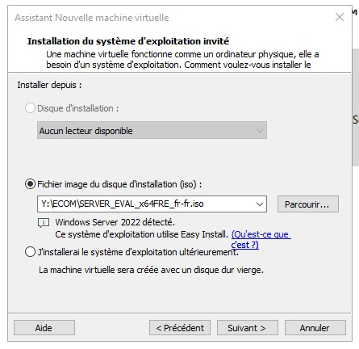
*Assistant de création de VM — sélection de l'ISO Windows Server 2022*

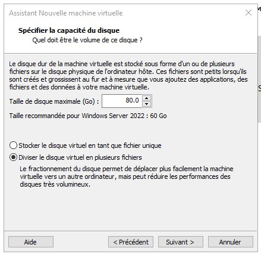
*Dimensionnement du disque virtuel — 80 Go alloués au contrôleur de domaine*

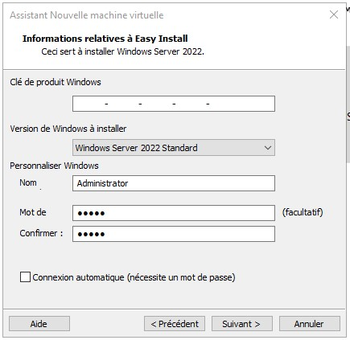
*Édition Windows Server 2022 Standard et définition du compte Administrateur*

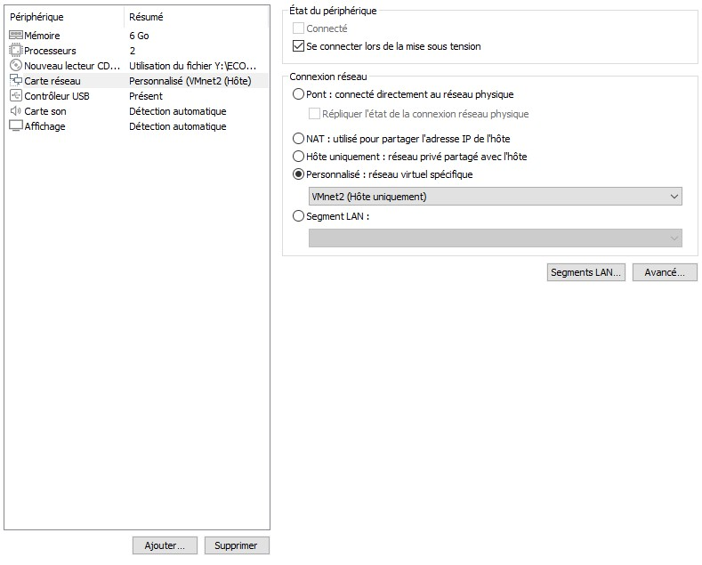
*Personnalisation matérielle — 6 Go de RAM, 2 vCPU, carte réseau raccordée à VMnet2 (réseau isolé du laboratoire)*

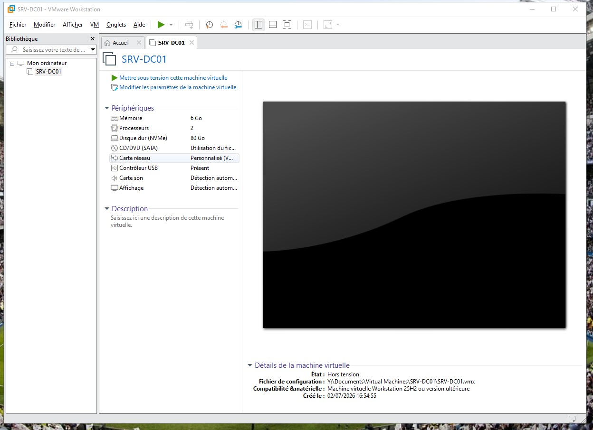
*Machine virtuelle SRV-DC01 créée et prête au premier démarrage*

### Installation et configuration initiale

*Premier démarrage — Gestionnaire de serveur avant toute configuration*

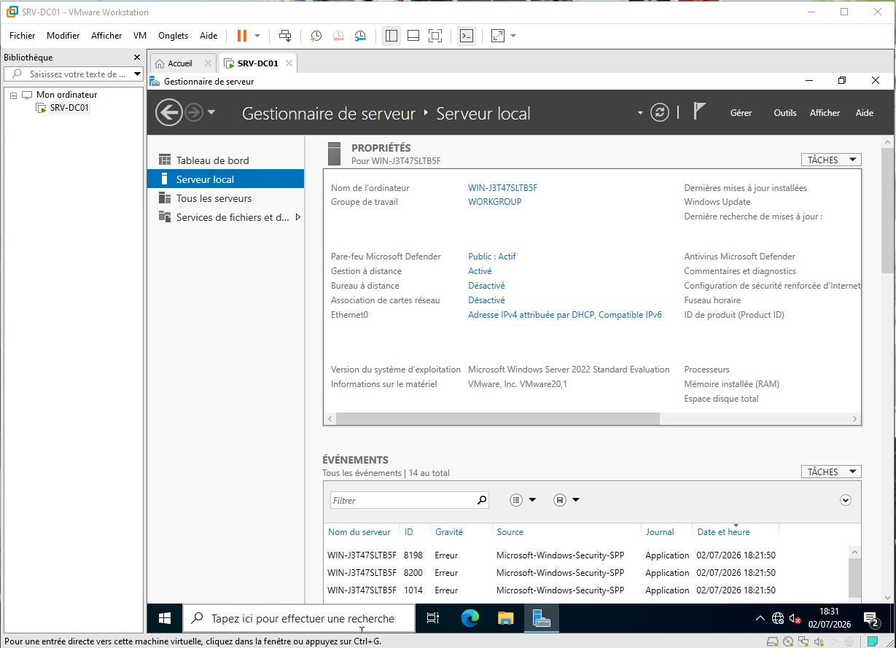
*État initial : nom généré automatiquement (WIN-J3T47SLTB5F), groupe de travail WORKGROUP et adresse IP en DHCP — trois points à corriger avant la promotion en contrôleur de domaine*

### Promotion en contrôleur de domaine

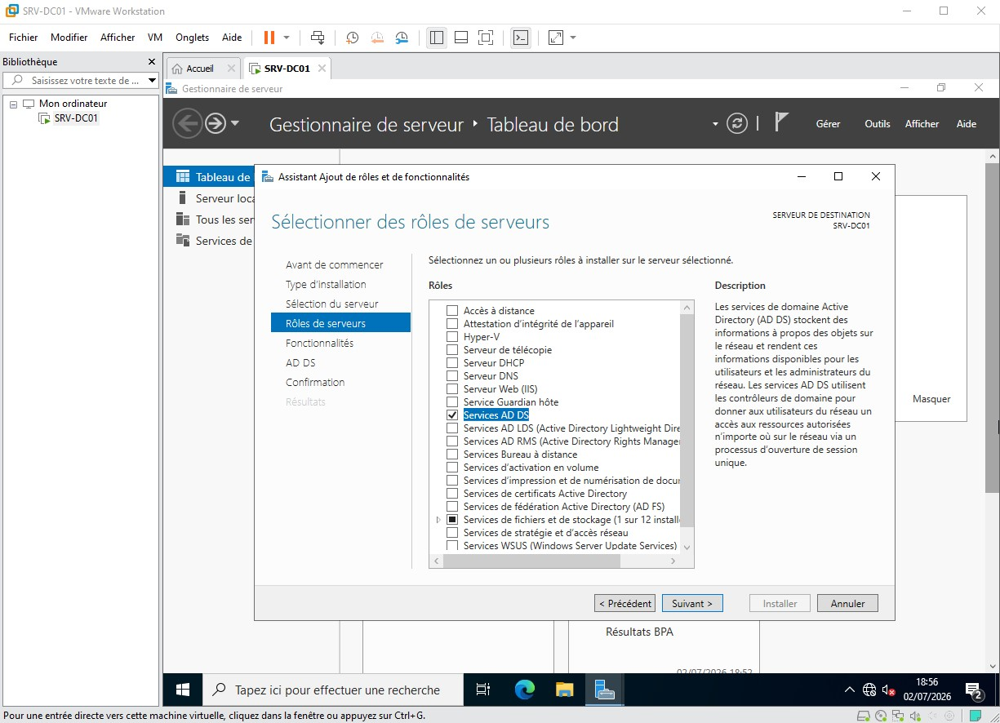
*Installation du rôle Services AD DS sur SRV-DC01*

*Assistant de configuration AD DS — choix du type de déploiement (option retenue : « Ajouter une nouvelle forêt »)*

*Options du contrôleur de domaine — niveau fonctionnel Windows Server 2016, serveur DNS et catalogue global activés, mot de passe DSRM défini*

### Validation du poste client

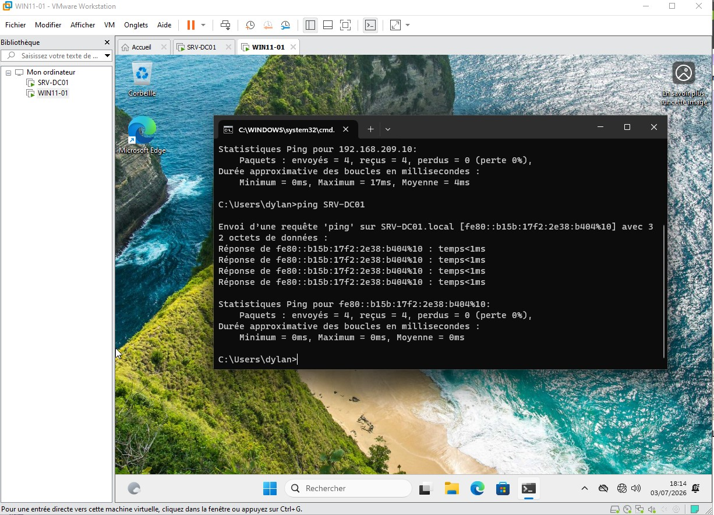
*Depuis WIN11-01 : ping du contrôleur de domaine par adresse IP puis par nom — la résolution DNS est fonctionnelle*

---

## Phase 3 — Service DHCP

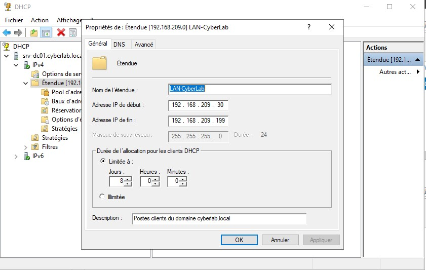
*Propriétés de l'étendue LAN-CyberLab — plage 192.168.209.30 à 192.168.209.199, bail de 8 jours*

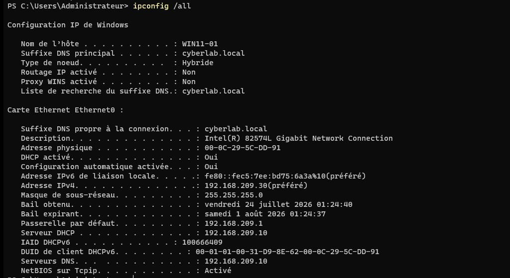
*WIN11-01 : adresse, passerelle, serveur DNS et suffixe de domaine reçus automatiquement — aucune valeur saisie manuellement sur le poste*

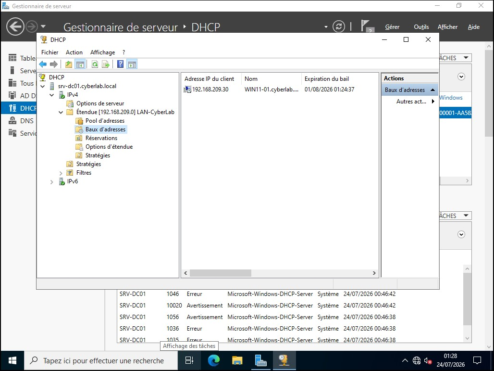
*Console DHCP — bail actif pour WIN11-01 en 192.168.209.30, confirmant l'attribution depuis le serveur*

---

## Règles appliquées

- **Anonymisation** — aucune donnée personnelle, adresse IP publique ou information sensible n'apparaît sur les captures.
- **Cadrage** — les captures sont recadrées sur l'information utile.
- **Légende systématique** — chaque image est accompagnée d'une description de ce qu'elle démontre.
